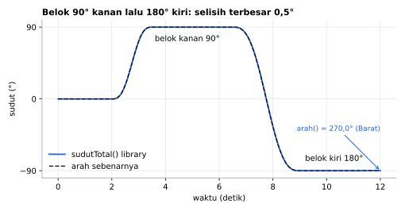
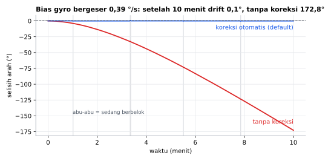
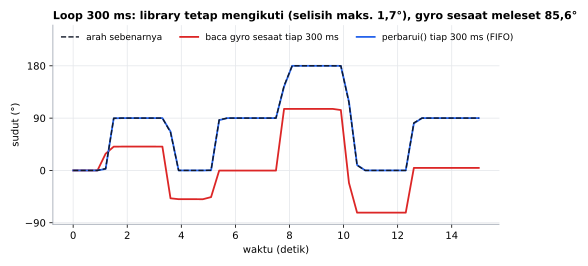

# ArahMPU6050 (English)

[Bahasa Indonesia](README.md)

An Arduino library that tracks **heading** with an **MPU6050** IMU: 0–360° heading, compass point names, shortest turn to a target angle, turn rate, and tilt. The API and examples are in Indonesian. This page maps every function to English.

> **Note:** the MPU6050 is an IMU (accelerometer + gyro), **not a compass**. It has no magnetometer, so the heading is **relative**: 0° is the direction at `mulai()` or `resetArah()`. The heading drifts slowly over minutes. This library reduces the drift but cannot remove it.

```cpp
#include <ArahMPU6050.h>

ArahMPU6050 sensor;

void setup() {
  Serial.begin(115200);
  if (!sensor.mulai()) {                  // begin()
    Serial.println("MPU6050 not found!");
    while (true) delay(10);
  }
  while (!sensor.kalibrasi()) Serial.println("Keep the sensor still...");  // calibrate()
}

void loop() {
  sensor.perbarui();                      // update()
  Serial.print(sensor.arah());            // heading, 0..360
  Serial.print(" ");
  Serial.println(sensor.mataAngin());     // compass point (Indonesian names)
  delay(100);
}
```

## Features

- **Tolerates a slow `loop()`**: the sensor buffers 100 Hz data in its internal FIFO, so `delay()`, WiFi, or an LCD in `loop()` do not lose rotation.
- **Tilt compensation**: the sensor can be tilted or mounted upright.
- **Automatic gyro bias correction** every time the sensor is still for ≥ 1 s, which also corrects temperature drift.
- **Safe calibration**: `kalibrasi()` returns `false` if the sensor was bumped.
- **Scale correction** for gyros that are off by 1–3%.
- Selectable gyro range (250–2000 °/s), **two sensors** (0x68 & 0x69), **custom I2C pins**, and a second I2C bus (`Wire1`).
- Clone MPU6050 modules are detected.

Compiles on Uno/Nano, Mega, ESP32, ESP32-C3/S3, STM32 Blackpill F411, and Bluepill F103 (STM32duino core).

## Simulation results

> These plots are **simulations with an emulated sensor**, not measurements of a real MPU6050. The real library code runs on a PC against an emulated MPU6050 (`extras/test/Wire.h`) that mimics the sensor's registers and 100 Hz FIFO, with synthetic motion, gyro bias, and noise.



A 90° right turn, then a 180° left turn: the library output matches the true heading.



The gyro bias drifts slowly for 10 minutes (as a warming sensor would) while the sensor is mostly still. With `aturKoreksiOtomatis(true)` (automatic correction, the default) the heading barely drifts.



A `loop()` with `delay(300)` and fast 0.4–0.8 s turns. `perbarui()` reads every 100 Hz sample from the FIFO, so no rotation is lost. The red line uses the same sensor and loop but reads the instantaneous gyro register every 300 ms and multiplies it by 0.3 s; its error depends on sample timing and is smaller for slower turns.

To regenerate:
```sh
cd extras/simulasi
python gambar.py   # needs g++ and matplotlib
```

## Function reference

| Indonesian | English | Notes |
|---|---|---|
| `mulai(TwoWire &wire = Wire, uint8_t alamat = 0x68)` | begin(wire, address) | `false` if the sensor does not respond |
| `kalibrasi(uint16_t sampel = 500)` | calibrate(samples) | ≈1 s, sensor must be still; `false` if it moved |
| `perbarui()` | update | call in `loop()`, at least every ≈0.8 s; `false` if data was lost |
| `arah()` | heading | 0–360°, clockwise |
| `mataAngin()` | compass point | `"Utara"` (north), `"Timur Laut"` (NE), `"Timur"` (E), `"Tenggara"` (SE), `"Selatan"` (S), `"Barat Daya"` (SW), `"Barat"` (W), `"Barat Laut"` (NW) |
| `mataAnginSingkat()` | short compass point | `"U"`, `"TL"`, `"T"`, `"TG"`, `"S"`, `"BD"`, `"B"`, `"BL"` |
| `selisihKe(float tujuan)` | difference to target | −180…180; positive = turn right |
| `sudutTotal()` | total angle | unwrapped (720 = two turns right) |
| `resetArah()` | reset heading | current direction becomes 0° |
| `aturArah(float derajat)` | set heading | |
| `kecepatanPutar()` | turn rate | °/s, positive = right |
| `diam()` | is still | still for ≥ 1 s |
| `kemiringanDepan()` | pitch (X tilt) | −90…90° |
| `kemiringanSamping()` | roll (Y tilt) | −90…90° |
| `aturRentangGyro(uint16_t dps)` | set gyro range | 250 / 500 (default) / 1000 / 2000 |
| `aturAmbangDiam(float dps)` | set stillness threshold | default 1.0 |
| `aturKoreksiOtomatis(bool aktif)` | set auto bias correction | default on; turn off for very slow constant rotation |
| `aturFaktorSkala(float faktor)` / `faktorSkala()` | set / get scale factor | from the `KalibrasiSkala` example |

## Examples

`DasarArah` (basics), `ResetKeUtara` (align 0° to true north with a button), `BelokKeSudut` (robot turns to a target angle), `KalibrasiSkala` (measure the scale factor with 10 turns), `GrafikPlotter` (Serial Plotter), `DuaSensor` (two sensors), `PinI2CKhusus` (custom I2C pins, `Wire1`), `Pengaturan` (all settings).

## License

MIT © 2026 Amadeo Wisesa.
